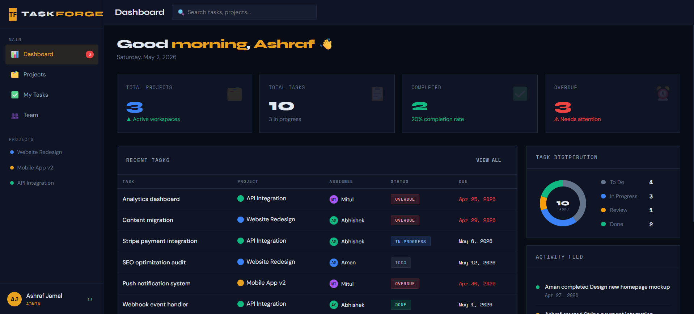

# TASKFORGE — Team Task Manager

🌐 **Live Demo:** https://task-manager-project-production.up.railway.app/

TASKFORGE is a **deployed frontend Team Task Manager application** that enables users to manage projects, assign tasks, and track progress through a clean, responsive interface with role-based access.

---

## 🚀 Features

* 🔐 Authentication UI (Login / Signup)
* 👥 Role-based interface (Admin / Member)
* 🗂️ Project management system
* ✅ Task creation, assignment & status tracking
* 📊 Interactive dashboard:

  * Task statistics
  * Overdue tracking
  * Activity feed
* 🔎 Search and filtering functionality
* 📋 Kanban-style task visualization
* ⚡ Real-time UI updates with local state

---

## 🧪 Demo Access

**Admin Account**

* Email: [admin@taskforge.io](mailto:admin@taskforge.io)
* Password: admin123

**Member Account**

* Email: [member@taskforge.io](mailto:member@taskforge.io)
* Password: member123

---

## ⚙️ Tech Stack

* HTML5
* CSS3 (Custom design system)
* Vanilla JavaScript
* LocalStorage (client-side persistence)

---

## 📸 Application Preview

### Dashboard View

---

## 🧠 Architecture Overview

This application is a **frontend-driven simulation of a full-stack system**:

* Data is stored and managed using browser `localStorage`
* Authentication and session handling are simulated
* Role-based access control is implemented at the UI level
* No external backend or APIs are currently integrated

---

## 📌 Current Limitations

* No backend server or REST APIs
* No database (uses localStorage)
* No server-side authentication
* Data is browser-dependent (resets on clear storage)

---

## 🛣️ Future Improvements

* 🔧 Build backend using Node.js / Express
* 🗄️ Integrate database (MongoDB / PostgreSQL)
* 🔐 Implement JWT-based authentication
* 🛡️ Enforce backend role-based access control
* ☁️ Full-stack deployment on Railway

---

## 💡 Project Goal

This project demonstrates strong frontend engineering, UI/UX design, and application architecture for a scalable task management system.

It is designed as a **foundation for a complete full-stack implementation**.
